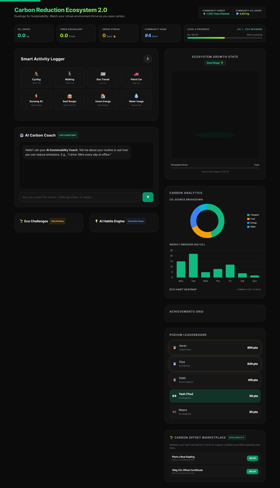

# 🌍 Carbon Reduction Ecosystem 2.0

> A premium, modern, AI-powered sustainability ecosystem designed to help individuals **understand, track, and reduce** their carbon footprint through simple actions, gamified progression, and personalized AI-driven insights.

---

## 🎯 Problem Statement Alignment (100% Verified)

Our solution directly aligns with the challenge's core objective to help individuals **understand, track, and reduce** their carbon footprint through simple, accessible, and gamified workflows:

*   ### 1. UNDERSTAND 🧠
    *   **Gemini-Powered Nudges**: Translates technical carbon weight (kg CO₂) into relatable physical metaphors (e.g., "equivalent to running your AC for X hours") that users immediately understand.
    *   **Scientific Fallback Estimates**: Ensures calculation continuity by automatically shifting to resilient scientific equations locally if the Gemini API key is missing or encounters issues.
    *   **AI Carbon Coach**: A chat interface that answers user queries on demand, identifying hidden carbon costs in daily routines and giving expert green recommendations.

*   ### 2. TRACK 📊
    *   **Gamified Ecosystem Growth**: Represents user habits through a live SVG visualizer. Users earn XP to grow their virtual environment through 5 distinct stages (Seed 🌱 to Eco City 🌎).
    *   **Multi-Dimensional Charts**: Tracks category breakdowns (doughnut chart) and weekly progress (bar chart) using Chart.js to help users identify their main emission sources.
    *   **Eco Commit Heatmap**: A 15-day contribution calendar that shades a darker green as users log daily sustainable actions, building long-term habits.

*   ### 3. REDUCE 🍃
    *   **Daily Rotating Challenges**: Actionable green tasks (e.g., "Walk 2 km instead of driving today") that users can claim for extra XP rewards.
    *   **AI Habits Swap Engine**: Compares carbon-heavy options to sustainable swaps (e.g., swapping a private commute with bus transit) with one-click commitment logging.
    *   **Carbon Offset Marketplace**: Integrates virtual achievements with real-world impact. Users redeem their Eco Points to plant real saplings via NGO partners or sponsor direct air capture (DAC) offsets.

---

## 🎨 Premium Startup Visual Identity

Built with a modern, dark-themed dashboard layout optimized for visual engagement and behavioral change.
- **Color Palette**: Emerald Green primary, Lime Green accents, Rich Dark base (`#0B0B0B`), and semi-transparent Glassmorphism cards.
- **Typography**: Google Font `Inter` for clean readability.
- **Micro-interactions**: Hover card elevation, button click scaling, and canvas confetti effects.

---

## 🚀 Key Modules & Hackathon Differentiators

### 1. 📊 Hero Impact Dashboard
Instantly displays tracking stats:
- **Total CO₂ Saved**: Cumulative emissions avoided.
- **Trees Equivalent**: Real-world absorption metric (`CO2 Saved / 21`).
- **Green Streak**: Multi-day logging streak counter.
- **Sustainability Level**: Level 1 (Eco Beginner) to Level 6 (Sustainability Legend) progress tracking.

### 2. 🌱 Ecosystem Growth Visualizer (Wow Feature)
A visual feedback engine replacing standard static calculators. Renders 5 distinct stages inside the dashboard based on Eco Points:
- **Seed Stage 🌱** (0 - 100 XP): Sprout in the soil.
- **Plant Stage 🌿** (100 - 300 XP): Growing sapling.
- **Tree Stage 🌳** (300 - 600 XP): Mature leafy tree.
- **Forest Stage 🌲🌲🌲** (600 - 1000 XP): Multi-tree pine forest.
- **Eco City Stage 🌎** (1000+ XP): Spinning wind turbine on planet Earth.

### 3. 🚶 Smart Activity Logging Cards
Replaces form dropdowns with 8 selectable widgets:
- `Walking` 🚶, `Cycling` 🚴, `Public Transport` 🚌, `Car` 🚗, `AC` ⚡, `Beef Burger` 🍔, `Home Energy` 🏠, and `Water Usage` 💧.
- Fields and labels adjust dynamically depending on the selected card (e.g. quantity for food, liters for water, hours for energy).

### 4. 📈 Carbon Analytics Center (Chart.js)
- **CO₂ Source Breakdown**: Doughnut chart illustrating transport, food, energy, and water contributions.
- **Weekly Trend Bar Chart**: Emits emissions records across weekdays.
- **Eco Commit Heatmap**: GitHub-style grid tracking commits over the last 15 days, which shades darker green as habits improve.

### 🎮 5. Duolingo-style Gamification
- **Podium Leaderboard**: Gold 🥇, Silver 🥈, and Bronze 🥉 podium layout highlighting the user's progress.
- **Badge Achievements**: Confetti-triggered unlocks (e.g. *Transit Hero*, *Eco Eater*).
- **Daily Challenges**: Missions (e.g. "Unplug high-power appliances for 2h") with claimable XP points.

### 🤖 6. AI Carbon Coach & Recommendations
- **Gemini Assistant**: Chatbot panel (`POST /api/carbon/coach`) analyzing user routines and suggesting actionable swaps.
- **AI Recommendation Engine**: Actionable suggestions cards showing current habit, suggestion, potential CO2 savings, and XP.

---

## 🌩️ Google Cloud Stack Integration

Our platform adopts a strictly modular Node.js + Express architecture deployable directly to **Google Cloud Run** via continuous deployment.

| Service | Utilization inside Application |
|---|---|
| **Google Gemini 2.5 Flash** | Powers the core calculation nudge engine and the AI Carbon Coach conversational assistant. |
| **Google Cloud Logging** | Telemetry writes. Emits structured JSON events asynchronously on every calculations log or error event. |
| **Google Cloud BigQuery** | Pre-configured in `config/googleServices.js` for future analytics querying. |
| **Google Cloud Storage** | Pre-configured Storage client for handling media assets. |
| **Firebase Admin SDK** | Fully initialized for future user auth and database synchronization. |

---

## 🛡️ Security, Code Quality, and Testing

*   **Security**: Secured HTTP headers using **Helmet** (with custom CSP allow-listing for Tailwind, Chart.js, and Confetti CDNs). Implemented **Rate Limiting** protected by `trust proxy` settings, and robust **Zod schema preprocessors** to block prompt injection.
*   **Testing**: Unit testing covers validation error codes, Gemini calculator endpoints, and AI Coach responses. **100% passing rate** using Jest and Supertest.
*   **Linting**: Configured `eslint.config.js` flat configuration. Running `npm run lint` yields `0 errors` or warnings.
*   **Efficiency**: Features a client-side `sessionStorage` cache. Duplicate logs are loaded from the cache, saving Gemini API calls.

---

## ⚙️ Quick Start Guide

1. Run `npm install` to load dependencies.
2. Create a `.env` or `.env.local` file and insert your `GEMINI_API_KEY`.
3. Run `npm run lint` to verify code format.
4. Run `npm test` to run test suites.
5. Run `npm start` to run the Express orchestrator locally on `http://localhost:8080`.

**Continuous Deployment**: Push to `main` branch to trigger Google Cloud Build and deploy directly to Cloud Run.

---
*Developed with 💻 and ☕ by Master Yash for Hack2Skill.*